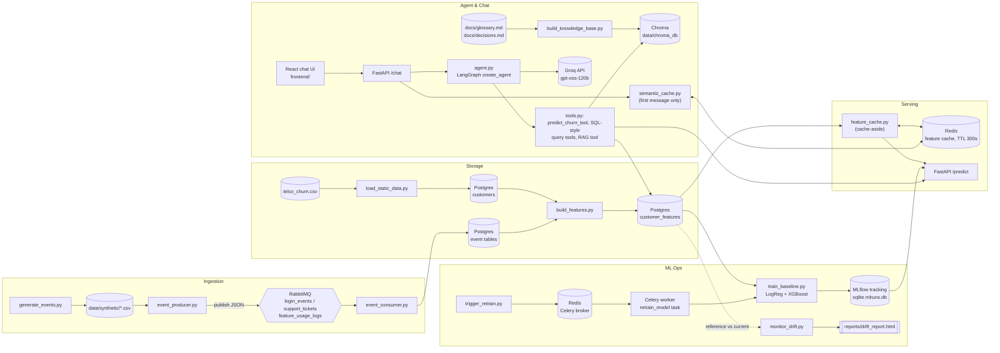

# ML Insight Platform

[](https://github.com/Harishchand83077/ml-insight-platform/actions/workflows/ci.yml)

A churn-prediction platform for a telecom customer base, built around an
event-driven data pipeline rather than a static training script. Synthetic
customer behavioral events (logins, support tickets, feature usage) are
streamed through RabbitMQ into Postgres, joined with the customer record
into a model-ready feature table, and served through a FastAPI endpoint
backed by a Redis cache. Model training is tracked in MLflow, feature
drift is monitored with Evidently, and retraining runs asynchronously via
Celery. A LangGraph agent sits on top of the same serving layer, answering
natural-language questions about a customer's churn risk, aggregate churn
statistics, and the project's own modeling decisions (via RAG over
`docs/`), exposed through a `/chat` endpoint and a small React frontend —
the goal is a working end-to-end ML system with real infrastructure seams
(queue, cache, DB, async worker, agent), not just a notebook that outputs
a metric.

## Architecture



## Tech stack

| Tool | Role |
|---|---|
| **RabbitMQ** | Event-driven ingestion backbone — three durable queues (`login_events`, `support_tickets`, `feature_usage_logs`) decouple the event producer from the consumer and simulate a live stream instead of a batch load. |
| **PostgreSQL** | System of record for everything relational: raw customer records, ingested event tables, and the computed `customer_features` table the models and API both read from. |
| **Redis** | Two jobs: cache-aside store in front of Postgres for `/predict` feature lookups (300s TTL), and the broker + result backend for Celery. |
| **pandas / numpy** | Synthetic event generation with per-customer randomized noise, and all feature-engineering aggregation (login trends, ticket resolution stats, usage rates). |
| **scikit-learn** | Preprocessing pipeline (one-hot encoding + scaling) and the Logistic Regression baseline; both models are persisted as a single fitted `Pipeline` so serving doesn't need to re-implement preprocessing. |
| **XGBoost** | Second baseline classifier, currently the stronger of the two on held-out F1/PR-AUC. |
| **MLflow** | Experiment tracking — params, metrics, the model artifact (full pipeline, not just the bare classifier), and feature-importance plots per run. The serving API loads the latest `xgboost` run directly from the tracking store at startup. |
| **FastAPI + Uvicorn** | Serving layer: `GET /health` and `POST /predict`. Model is loaded once at process startup, not per-request. |
| **Evidently** | Data drift detection between the training-time reference distribution and a simulated "current" sample, with an HTML report and per-column drift scores. |
| **Celery** | Decouples retraining from the request path — `trigger_retrain.py` enqueues a job, a worker process runs the actual training. |
| **LangChain + LangGraph** | The churn-analytics agent (`create_agent`, the current LangGraph-based tool-calling pattern) with four tools bound to it: prediction lookup, two SQL-style query tools with a column allowlist (no agent-constructed SQL), and a RAG tool over the project's own docs. |
| **Groq** | LLM inference for the agent (`openai/gpt-oss-120b`) — fast, free-tier hosted inference so the agent doesn't need a local GPU. |
| **ChromaDB + sentence-transformers** | Local, free retrieval-augmented generation: `docs/glossary.md` and `docs/decisions.md` are chunked, embedded with `BAAI/bge-small-en-v1.5`, and stored in a local Chroma vector store the RAG tool queries. |
| **React + Vite** | Minimal dark-themed chat UI (`frontend/`) against `/chat` and `/chat/{session_id}`, with per-session memory, collapsible tool-call inspection, and Markdown-rendered responses. |
| **pytest + ruff** | Unit tests with coverage (`tests/unit`, DB/Redis/LLM calls mocked) and opt-in integration tests (`tests/integration`, real services); ruff scoped to real errors only, not style. |
| **GitHub Actions** | CI on every push/PR to `main`: lint + unit tests + coverage, plus a separate job confirming the FastAPI service's Docker image builds. |
| **Docker** | Runs RabbitMQ, Postgres, and Redis as isolated local services (`rabbitmq:3-management`, `postgres:16`, `redis:7`), and packages the FastAPI service itself for CI's build-verification job. |

## How to run locally

**1. Start the infrastructure containers**

```bash
docker run -d --name rabbitmq -p 5672:5672 -p 15672:15672 rabbitmq:3-management
docker run -d --name postgres-ml -p 5432:5432 -e POSTGRES_PASSWORD=devpassword -e POSTGRES_DB=ml_insight -v pgdata:/var/lib/postgresql/data postgres:16
docker run -d --name redis-ml -p 6379:6379 redis:7
```

**2. Install Python dependencies**

```bash
python -m venv venv
venv\Scripts\activate        # Windows; source venv/bin/activate on Linux/Mac
pip install -r requirements.txt
```

**3. Generate synthetic data and load Postgres**

```bash
python src/data_gen/generate_events.py       # writes data/synthetic/*.csv
python src/pipelines/load_static_data.py     # loads data/raw/telco_churn.csv.csv -> customers table
```

**4. Stream the synthetic events through RabbitMQ into Postgres**

```bash
python src/ingestion/event_consumer.py       # run in its own terminal, keeps running
python src/ingestion/event_producer.py       # publishes the CSVs, then exits
```

**5. Build the model-ready feature table**

```bash
python src/pipelines/build_features.py       # writes customer_features table + data/processed/features.csv
```

**6. Train the baseline models (tracked in MLflow)**

```bash
python src/models/train_baseline.py
mlflow ui --backend-store-uri sqlite:///mlruns.db --port 5000   # http://localhost:5000
```

**7. Check for feature drift**

```bash
python src/models/monitor_drift.py           # writes reports/drift_report.html
```

**8. Set up the agent**

```bash
echo GROQ_API_KEY=your-key-here > .env   # free tier at console.groq.com
python src/agent/build_knowledge_base.py   # embeds docs/*.md into data/chroma_db/
```

**9. Serve predictions and chat**

```bash
uvicorn src.serving.api:app --reload --port 8000
curl -X POST http://localhost:8000/predict -H "Content-Type: application/json" -d "{\"customer_id\": \"7590-VHVEG\"}"
curl -X POST http://localhost:8000/chat -H "Content-Type: application/json" -d "{\"session_id\": \"test-1\", \"message\": \"What is the churn risk for customer 7590-VHVEG?\"}"
```

**10. Run the chat frontend**

```bash
cd frontend
npm install
npm run dev   # http://localhost:5173
```

**11. Trigger an async retrain**

```bash
celery -A src.pipelines.retrain_task worker --loglevel=info --pool=solo   # --pool=solo is required on Windows
python src/pipelines/trigger_retrain.py
```

**12. Run the tests**

```bash
pytest tests/unit                              # fast, no external services needed
pytest tests/unit --cov=src --cov-report=term-missing   # with coverage
ruff check src tests                           # lint (real errors only)
pytest tests/integration --run-integration     # needs Postgres/Redis + GROQ_API_KEY, makes real LLM calls
```

**13. Build the FastAPI service's Docker image** (optional - CI does this automatically)

```bash
docker build -t ml-insight-api .   # uses requirements-docker.txt, a curated runtime-only subset of requirements.txt
```

## Current status

**Built:**
- Synthetic event generation with per-customer randomized, directionally-correlated (not deterministic) drift toward churn behavior across logins, support tickets, and feature usage
- RabbitMQ ingestion: producer/consumer pair, 3 durable queues, batched + idle-flushed commits into Postgres
- Postgres schema: `customers`, `login_events`, `support_tickets`, `feature_usage_logs`, `customer_features`
- Feature engineering pipeline joining customer attributes with event-derived aggregates
- Two baseline models (Logistic Regression, XGBoost) tracked in MLflow, with feature-importance plots logged per run. Current test-set metrics: **F1 0.69 / PR-AUC 0.78 (XGBoost)**, **F1 0.66 / PR-AUC 0.77 (Logistic Regression)**
- Redis cache-aside layer for feature lookups, with a connection-pooled Postgres fallback
- FastAPI serving endpoint (`/health`, `/predict`) loading the model once at startup
- Evidently drift monitoring comparing training-time vs. simulated current feature distributions
- Celery + Redis async retraining, triggered independently of the request path
- LangChain agent (`src/agent/`) with tool-calling over churn prediction, aggregate SQL-style queries, and RAG over the project's own docs, served through `/chat` with per-session memory and a semantic response cache; a minimal React chat frontend in `frontend/`
- Unit test suite (`tests/unit`, pytest + coverage) and integration tests (`tests/integration`, opt-in via `--run-integration`)
- CI (`.github/workflows/ci.yml`): lint (ruff) + unit tests + coverage on every push/PR to main, plus a separate job confirming the FastAPI service's Docker image builds

**Planned:**
- Deployment (currently local-only, no cloud target set up)
