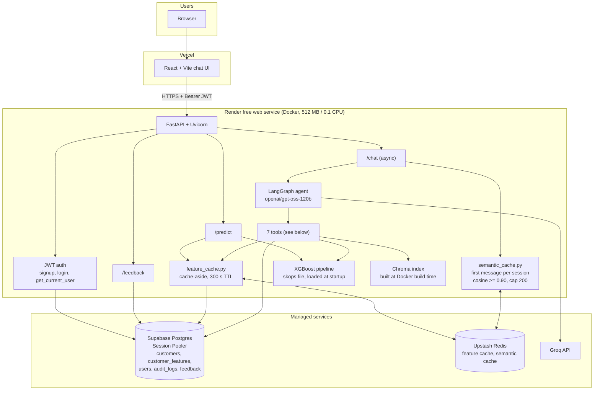
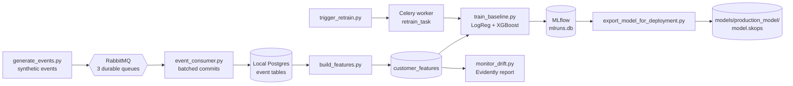

# ML Insight Platform

[](https://github.com/Harishchand83077/ml-insight-platform/actions/workflows/ci.yml)

A churn-prediction service for a synthetic telecom customer base. It has an
XGBoost model behind a JWT-authenticated FastAPI backend, a LangGraph agent
with seven tools, retrieval over the project's own documents, and a React
chat frontend. Ingestion, retraining, and drift monitoring run locally. The
serving path is what's deployed.

All customer data is synthetic. The base schema follows the IBM Telco
Customer Churn layout, with a synthetic behavioral-event layer on top. The
company "Vantrix Communications" in `docs/knowledge_base/` is also invented.

For a shorter technical overview, see [docs/ARCHITECTURE_SUMMARY.md](docs/ARCHITECTURE_SUMMARY.md).

## Live demo

- Frontend: https://ml-insight-platform.vercel.app
- Backend API: https://ml-insight-platform.onrender.com (`/health`, `/auth/signup`, `/auth/login`, `/predict`, `/chat`, `/feedback`)

**Free-tier cold start.** The backend runs on Render's free tier, which spins
the service down when idle. The first request after idle waits for the
container to restart and for the models to load. Expect tens of seconds
(commonly around 30–60 s); this repo doesn't record a measured figure. The
frontend shows a "server waking up" state while it polls `/health`.
`/health` returns 200 as soon as the process starts. `/predict` and `/chat`
return 503 until `models_ready` is true, so the first real request after a
wake-up can be slower than later ones.

The repo doesn't track which commit Render is running. Check the Render
dashboard for the deployed commit.

## Architecture


```mermaid
flowchart TB
    subgraph Users
        BROWSER["Browser"]
    end

    subgraph Vercel
        UI["React + Vite chat UI"]
    end

    subgraph Render["Render free web service (Docker, 512 MB / 0.1 CPU)"]
        API["FastAPI + Uvicorn"]
        AUTH["JWT auth<br/>signup, login, get_current_user"]
        CHAT["/chat (async)"]
        PRED["/predict"]
        FB["/feedback"]
        SEM["semantic_cache.py<br/>first message per session<br/>cosine >= 0.90, cap 200"]
        FC["feature_cache.py<br/>cache-aside, 300 s TTL"]
        AGENT["LangGraph agent<br/>openai/gpt-oss-120b"]
        TOOLS["7 tools (see below)"]
        MODEL["XGBoost pipeline<br/>skops file, loaded at startup"]
        RAG["Chroma index<br/>built at Docker build time"]
    end

    subgraph Managed["Managed services"]
        SUPA[("Supabase Postgres<br/>Session Pooler<br/>customers, customer_features,<br/>users, audit_logs, feedback")]
        UPSTASH[("Upstash Redis<br/>feature cache, semantic cache")]
        GROQ["Groq API"]
    end

    BROWSER --> UI
    UI -->|HTTPS + Bearer JWT| API
    API --> AUTH
    AUTH --> SUPA
    API --> PRED
    API --> FB
    FB --> SUPA
    PRED --> FC
    PRED --> MODEL
    FC <--> UPSTASH
    FC --> SUPA
    API --> CHAT
    CHAT --> SEM
    SEM <--> UPSTASH
    CHAT --> AGENT
    AGENT --> GROQ
    AGENT --> TOOLS
    TOOLS --> MODEL
    TOOLS --> FC
    TOOLS --> SUPA
    TOOLS --> RAG
```

**Ingestion, training, and MLOps (local only, not deployed):**


```mermaid
flowchart LR
    GEN["generate_events.py<br/>synthetic events"] --> RMQ{{"RabbitMQ<br/>3 durable queues"}}
    RMQ --> CONS["event_consumer.py<br/>batched commits"]
    CONS --> LPG[("Local Postgres<br/>event tables")]
    LPG --> BF["build_features.py"]
    BF --> FT[("customer_features")]
    FT --> TRAIN["train_baseline.py<br/>LogReg + XGBoost"]
    TRAIN --> MLF[("MLflow<br/>mlruns.db")]
    MLF --> EXPORT["export_model_for_deployment.py"]
    EXPORT --> SKOPS[("models/production_model/<br/>model.skops")]
    FT --> DRIFT["monitor_drift.py<br/>Evidently report"]
    TRIG["trigger_retrain.py"] --> CELERY["Celery worker<br/>retrain_task"]
    CELERY --> TRAIN
```

**RAG path.** `docs/glossary.md`, `docs/decisions.md`, and the 11 files in
`docs/knowledge_base/` are split by Markdown heading with a 480-token size
cap, embedded with `BAAI/bge-small-en-v1.5`, and written to a Chroma
collection. The Dockerfile runs `build_knowledge_base.py` at image build time
and fails the build if the collection has fewer than 50 chunks. The last image
build produced 128 chunks. Each retrieved chunk is labeled
`[source: file.md > Section]`.

## Features

**Agent tools.** The agent has seven tools. Each is called in-process, not over HTTP.

| Tool | What it does |
|---|---|
| `predict_churn_tool` | Returns one customer's churn probability and a 0.5-threshold label. |
| `explain_churn_tool` | Lists that customer's top five feature contributions in log-odds, computed with XGBoost's native `pred_contribs`. Narration is constrained to factual framing. |
| `simulate_churn_tool` | Re-scores a customer with validated account-field overrides (contract, payment method, tenure, and so on) and reports before, after, and the delta. This is the model's output, not a causal forecast. |
| `recommend_retention_tool` | Maps the customer's largest risk factor to one of six hand-written actions. This is a simple rule table, not a learned policy, and it isn't validated against outcomes. |
| `get_churn_rate_by_column` | Churn rate broken down by an allowlisted `customer_features` column. The agent never writes SQL; column names are checked against an allowlist, and values are passed as query parameters. |
| `get_customer_count` | Counts customers matching allowlisted equality filters. |
| `query_project_docs_tool` | Vector search over the glossary, decision log, and policy documents. Returns labeled chunks for the agent to cite. |

**Other features**

- **Authentication.** `POST /auth/signup` and `POST /auth/login`. Passwords are hashed with bcrypt through passlib; `bcrypt` is pinned to 4.0.1 because passlib 1.7.4 breaks on newer bcrypt. Tokens are HS256 JWTs from PyJWT, valid for 24 hours. Login failures return a generic 401. `/predict`, `/chat`, `/feedback`, and `DELETE /chat/{session_id}` require a token.
- **Audit log.** Each `/predict` and `/chat` call writes a row to `audit_logs`. Logging is best-effort and never fails the request.
- **Caching.** Feature lookups are cache-aside in Redis with a 300 s TTL and a Postgres fallback through a connection pool. The semantic response cache covers the first message of each session only, using cosine similarity (threshold 0.90, capped at 200 entries).
- **Test-only cache bypass.** `X-Cache-Bypass` skips the semantic cache, but only when it matches the server's `CACHE_BYPASS_TOKEN`. If the server has no token set, the header is rejected. See `CLAUDE.md`.
- **Chat sessions.** Per-session history is kept in process memory (see Known limitations).
- **Feedback.** Thumbs up or down per assistant message, stored in Postgres with a `CHECK` constraint on the rating.
- **Drift monitoring.** Evidently compares training-time feature distributions with a shifted sample. On the injected-shift test, 2 of 3 shifted columns were flagged.
- **Async retraining.** A Celery worker retrains and logs a new MLflow run. Local only.
- **Monitoring.** Prometheus metrics, with custom counters for feature-cache hits and misses, semantic-cache hits, and agent latency. Grafana config is in `monitoring/`. Local only.
- **Tests and CI.** 42 unit tests with all external services mocked. Opt-in integration tests, and a Locust load-test file. GitHub Actions runs ruff (errors only), the unit suite with coverage, and a Docker build on every push and PR to `main`.

## Tech stack

| Tool | Role |
|---|---|
| **FastAPI + Uvicorn** | Serving layer. The model and embedder load in a background task, so `/health` answers immediately. The Docker CMD runs uvicorn as PID 1 so SIGTERM reaches it directly. |
| **PyJWT + passlib (bcrypt)** | Auth. HS256 tokens signed with `JWT_SECRET_KEY`, read lazily. Password hashing through passlib, with bcrypt pinned to 4.0.1. |
| **PostgreSQL (Supabase)** | System of record: `customers`, `customer_features`, `users`, `audit_logs`, `feedback`. Connected through the Session Pooler, because Render's free tier has no outbound IPv6. |
| **Redis (Upstash)** | Feature cache, semantic response cache, and (locally) the Celery broker. |
| **scikit-learn + XGBoost** | Preprocessing pipeline and the two baseline classifiers. XGBoost is the one served. Its native `pred_contribs` gives the explanations. |
| **skops** | Loads the trained pipeline at serve time with explicit trusted types. Used in place of mlflow at serve time, which kept mlflow's footprint out of the container. |
| **MLflow** | Training-time experiment tracking. Not installed in the serving image. |
| **Evidently** | Feature drift reports. Local only. |
| **Celery + Redis** | Async retraining. Local only; needs `--pool=solo` on Windows. |
| **RabbitMQ** | Local event ingestion: three durable queues between the producer and the Postgres consumer. |
| **LangChain + LangGraph** | `create_agent` tool-calling agent with the seven tools above. The agent is built lazily, so importing the code doesn't need `GROQ_API_KEY`. |
| **Groq** | LLM inference with `openai/gpt-oss-120b`. |
| **ChromaDB + sentence-transformers** | Vector store and embeddings (`BAAI/bge-small-en-v1.5`). One loaded embedder is shared by the RAG tool and the semantic cache. |
| **rank_bm25** | **Present in requirements but not used by the live tool.** Hybrid BM25+vector retrieval was measured and rejected; see Known limitations. |
| **React + Vite** | Chat UI. The JWT is held in React state, not `localStorage`. |
| **Docker** | Serving image: CPU-only torch, a pre-cached embedding model, a build-time Chroma index, and a CMD in exec form. Also local Postgres/Redis/RabbitMQ containers for development. |
| **pytest + ruff + GitHub Actions** | Unit tests, lint (`E9`, `F` only), CI. |

## Measured results

**Churn model**, on a stratified 20% held-out split (`random_state=42`), from
`docs/decisions.md` and the model card:

| Model | F1 | PR-AUC |
|---|---|---|
| XGBoost (served) | 0.69 | 0.78 |
| Logistic Regression | 0.66 | 0.77 |

The churn rate is 26.5%, so F1 and PR-AUC are the primary metrics. An earlier
version of the synthetic data generator leaked the label through event-derived
features, which gave F1 around 0.96–0.99 and PR-AUC around 0.99. The generator
was reworked, and all numbers above are from after that fix.

**Memory and the 512 MB limit**, from `docs/decisions.md`:

- Before the fix, the idle baseline was **749 MB** in a 900 MB test. At the literal Render limit of **512 MB / 0.1 CPU**, the container was OOM-killed during startup after about 22 minutes of thrashing.
- After the fix (mlflow removed from the serving path, skops loading, and embedding calls moved off the event loop), the heaviest test passed. It ran two tool calls per request and repeated three times at 512 MB / 0.1 CPU. Peak RSS was **489.5–489.8 MiB** with no growth between runs and no OOM. That leaves about **22 MB of headroom** under worst-case load.
- `/health` latency still spikes under heavy agent load, up to 9.2 s in the recorded run. The cause was attributed to CPU quota throttling.
- The explainability tool first used `shap.TreeExplainer`, which added about 64 MB on its first call. Switching to XGBoost's native contributions removed that cost.

**RAG retrieval.** These numbers come from `reports/rag_eval_*.json`. The
question set has 17 items: 6 exact-term, 8 paraphrase, and 3 unanswerable.

| Retriever | Exact-term hit@1 / hit@3 | Paraphrase hit@1 / hit@3 | Unanswerable flagged above 0.5 |
|---|---|---|---|
| Vector only (**live**) | 0.67 / 1.00 | 0.875 / 1.00 | 1 of 3 |
| Hybrid, BM25 0.5 / vector 0.5 | 0.67 / 1.00 | 0.75 / 0.875 | 2 of 3 |
| Hybrid, BM25 0.7 / vector 0.3 | 1.00 / 1.00 | 0.625 / 0.625 | 3 of 3 |

## Known limitations

- **Memory headroom.** The worst-case test peaked at 489.8 MiB on a 512 MB instance, about 22 MB of headroom. Larger concurrent load, a bigger embedding model, or extra features would likely exceed it. The next memory step, replacing torch and sentence-transformers with an ONNX runtime, was deliberately not taken.
- **In-memory chat sessions.** `/chat` history lives in a Python dict in the API process. It's lost on restart and not shared between instances.
- **Local-only components.** RabbitMQ ingestion, the Celery retraining worker, MLflow tracking, Evidently reports, and the Grafana/Prometheus stack are not deployed. The served model is a file exported from MLflow, not loaded from a tracking store.
- **Single-instance scale.** Render's free tier runs one container, and the app runs one uvicorn worker. Concurrency is limited by CPU quota (0.1 CPU) and memory.
- **Hybrid search evaluated and rejected.** BM25 + vector fusion was tested at two weightings. At 0.5/0.5 it gave no exact-term gain and was worse elsewhere. At 0.7/0.3 it raised exact-term hit@1 from 0.67 to 1.00, but dropped paraphrase hit@1 to 0.625, and all three unanswerable questions were flagged. The live tool uses vector search only. The `hybrid_retriever.py` module and `rank_bm25` dependency remain. The decisions.md entry is in `docs/decisions.md` under "Hybrid search: tested, not adopted (Week 9)". **That entry says unanswerable flagging dropped to 0/3. The eval reports show it went from 1/3 to 3/3.** The reports are the source of truth; the entry needs correcting.
- **JWT in React state, not `localStorage`.** This is deliberate. The cost is that a page refresh logs the user out.
- **Semantic cache scope.** Only the first message of each session is eligible. The cache matches reworded questions too, so tests need the bypass header or clearly different wording.
- **Explanations are associational.** Contributions and what-if numbers describe the model's output. They are not causal effects. The retention rules are hand-written and unvalidated.
- **Synthetic data.** Metrics and RAG results describe the synthetic dataset and the invented company documents.
- **Not done:** hyperparameter tuning, a fairness audit, a durable session store, and multi-worker serving.

## How to run locally

**1. Environment.** Copy `.env.example` to `.env` and set:

```bash
GROQ_API_KEY=...                  # https://console.groq.com
JWT_SECRET_KEY=...                # python -c "import secrets; print(secrets.token_hex(32))"
SUPABASE_DB_URL=postgresql://...  # or DATABASE_URL, or the PG_* vars for a local Postgres
REDIS_URL=redis://localhost:6379  # or rediss://... for Upstash
CACHE_BYPASS_TOKEN=...            # optional; only for tests that need to skip the semantic cache
```

Importing the app doesn't need any of these. Each one is read when first used,
and a missing value raises a clear error at that point.

**2. Infrastructure containers** (optional local Postgres, Redis, RabbitMQ):

```bash
docker run -d --name rabbitmq -p 5672:5672 -p 15672:15672 rabbitmq:3-management
docker run -d --name postgres-ml -p 5432:5432 -e POSTGRES_PASSWORD=devpassword -e POSTGRES_DB=ml_insight -v pgdata:/var/lib/postgresql/data postgres:16
docker run -d --name redis-ml -p 6379:6379 redis:7
```

**3. Python dependencies**

```bash
python -m venv venv
venv\Scripts\activate            # Windows; source venv/bin/activate elsewhere
pip install -r requirements.txt  # full dev environment
```

**4. Data and features**

```bash
python src/data_gen/generate_events.py
python src/pipelines/load_static_data.py
python src/ingestion/event_consumer.py   # separate terminal, keep running
python src/ingestion/event_producer.py
python src/pipelines/build_features.py
```

**5. Train and export the model**

```bash
python src/models/train_baseline.py
python scripts/export_model_for_deployment.py   # writes models/production_model/model.skops
mlflow ui --backend-store-uri sqlite:///mlruns.db --port 5000
```

**6. Build the RAG index**

```bash
python src/agent/build_knowledge_base.py
```

**7. Serve**

```bash
uvicorn src.serving.api:app --reload --port 8000
# wait until /health reports "models_ready": true
curl -X POST http://localhost:8000/auth/signup -H "Content-Type: application/json" -d '{"email":"you@example.com","password":"TestPass123!"}'
curl -X POST http://localhost:8000/auth/login  -H "Content-Type: application/json" -d '{"email":"you@example.com","password":"TestPass123!"}'
# use the access_token from the login response as $TOKEN:
curl -X POST http://localhost:8000/predict -H "Authorization: Bearer $TOKEN" -H "Content-Type: application/json" -d '{"customer_id":"7590-VHVEG"}'
curl -X POST http://localhost:8000/chat -H "Authorization: Bearer $TOKEN" -H "Content-Type: application/json" -d '{"session_id":"test-1","message":"What is the early termination fee for a 2-year contract?"}'
```

**8. Frontend**

```bash
cd frontend
npm install
npm run dev   # http://localhost:5173
```

**9. Tests and evaluation**

```bash
pytest tests/unit                          # no external services needed
ruff check src tests scripts
pytest tests/integration --run-integration # needs Postgres, Redis, GROQ_API_KEY; makes real LLM calls
python tests/eval/rag_eval.py              # writes reports/rag_eval_baseline.json
python tests/eval/rag_eval.py --hybrid     # writes reports/rag_eval_hybrid.json
```

**10. Docker image** (what Render builds)

```bash
docker build -t ml-insight-api .
docker run --rm -p 8000:8000 --env-file .env ml-insight-api
```

The build runs `build_knowledge_base.py` and fails if the index has fewer than
50 chunks. `--env-file` doesn't strip quotes the way python-dotenv does, so
write values without quotes.

## Repository layout

- `src/serving/`: FastAPI app (`api.py`), auth, feature cache, prediction, explanations, feedback
- `src/agent/`: agent, the seven tools, semantic cache, RAG build, hybrid retriever (unused)
- `src/common/`: shared singletons (embedder, production model), Postgres and Redis helpers
- `src/models/`: training, inference preparation, drift monitoring
- `src/ingestion/`, `src/pipelines/`, `src/data_gen/`: local event pipeline and retraining
- `docs/`: decision log, glossary, PRD, `knowledge_base/` (synthetic policy docs indexed for RAG), `ARCHITECTURE_SUMMARY.md`
- `frontend/`: React chat UI
- `tests/unit`, `tests/integration`, `tests/load`, `tests/eval`: tests, Locust, RAG evaluation
- `reports/`: drift and load-test HTML, RAG evaluation JSON
- `CLAUDE.md`: testing notes, including the cache bypass
