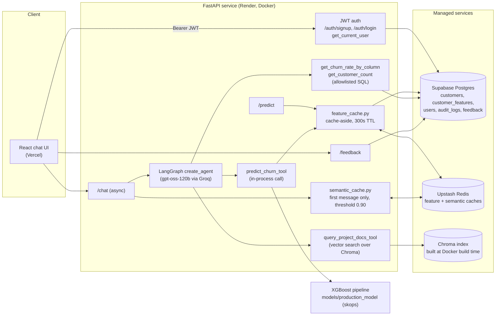
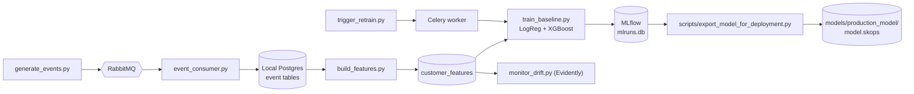

# ML Insight Platform

[](https://github.com/Harishchand83077/ml-insight-platform/actions/workflows/ci.yml)

A churn-prediction service for a synthetic telecom customer base, with a
JWT-authenticated FastAPI backend, a LangChain/LangGraph agent with tool
calling and retrieval over the project's own docs, and a React chat
frontend. Training, event ingestion, drift monitoring, and async
retraining run locally; the serving path is what's deployed.

All customer data is synthetic (the base schema follows the IBM Telco
Customer Churn layout, with a synthetic behavioral-event layer on top).
The fictional company "Vantrix Communications" in `docs/knowledge_base/`
is also invented.

## Live demo

- Frontend: https://ml-insight-platform.vercel.app
- Backend API: https://ml-insight-platform.onrender.com (`/health`, `/auth/signup`, `/auth/login`, `/predict`, `/chat`, `/feedback`)

**Cold-start behavior (free tiers):**

- Render's free web service spins down after a period of inactivity. Waking it takes on the order of tens of seconds (commonly ~30–60 s); this repo doesn't record a measured figure. The frontend polls `/health` and shows a "server waking up" state instead of failing.
- `/health` returns 200 as soon as the process starts, before the models load. `/predict` and `/chat` return 503 until `models_ready` is true. First requests after a wake-up can be slower than steady-state, because the XGBoost pipeline and the embedding model are loaded at startup, and the feature cache and Supabase pooler connections are cold.
- Render's free instance has 512 MB RAM and 0.1 CPU. See "Known limitations" for measured memory.

Which code is live is not tracked in this repo. The last redeploy recorded in `docs/decisions.md` predates the build-time RAG index, the lazy connection-pool and JWT changes, and the RAG retriever work described below. Check the Render dashboard for the deployed commit.

## Architecture


```mermaid
flowchart LR
    subgraph Client
        UI["React chat UI<br/>(Vercel)"]
    end

    subgraph Backend["FastAPI service (Render, Docker)"]
        AUTH["JWT auth<br/>/auth/signup, /auth/login<br/>get_current_user"]
        PRED["/predict"]
        CHAT["/chat (async)"]
        FB["/feedback"]
        FC["feature_cache.py<br/>cache-aside, 300s TTL"]
        SC["semantic_cache.py<br/>first message only, threshold 0.90"]
        AGENT["LangGraph create_agent<br/>(gpt-oss-120b via Groq)"]
        T1["predict_churn_tool<br/>(in-process call)"]
        T2["get_churn_rate_by_column<br/>get_customer_count<br/>(allowlisted SQL)"]
        T3["query_project_docs_tool<br/>(vector search over Chroma)"]
    end

    subgraph Data["Managed services"]
        PG[("Supabase Postgres<br/>customers, customer_features,<br/>users, audit_logs, feedback")]
        REDIS[("Upstash Redis<br/>feature + semantic caches")]
        CHROMA[("Chroma index<br/>built at Docker build time")]
    end

    UI -->|Bearer JWT| AUTH
    UI --> CHAT
    UI --> FB
    AUTH --> PG
    PRED --> FC
    FC <--> REDIS
    FC --> PG
    CHAT --> SC
    SC <--> REDIS
    CHAT --> AGENT
    AGENT --> T1
    AGENT --> T2
    AGENT --> T3
    T1 --> FC
    T1 --> MODEL["XGBoost pipeline<br/>models/production_model (skops)"]
    T2 --> PG
    T3 --> CHROMA
    FB --> PG
```

Local-only components (not deployed): RabbitMQ event ingestion
(`event_producer.py` → `event_consumer.py`), feature building from the
event tables, MLflow tracking, Evidently drift reports, and the Celery
retraining worker.


```mermaid
flowchart LR
    GEN["generate_events.py"] --> RMQ{{"RabbitMQ"}}
    RMQ --> CONS["event_consumer.py"] --> LPG[("Local Postgres<br/>event tables")]
    LPG --> BF["build_features.py"] --> FT[("customer_features")]
    FT --> TRAIN["train_baseline.py<br/>LogReg + XGBoost"] --> MLF[("MLflow<br/>mlruns.db")]
    MLF --> EXP["scripts/export_model_for_deployment.py"] --> MP[("models/production_model/<br/>model.skops")]
    FT --> DRIFT["monitor_drift.py (Evidently)"]
    TRIG["trigger_retrain.py"] --> CEL["Celery worker"] --> TRAIN
```

**RAG path, specifically:** `docs/glossary.md`, `docs/decisions.md`, and
the 11 files in `docs/knowledge_base/` are split by Markdown heading
(`MarkdownHeaderTextSplitter`) with a 480-token size cap, embedded with
`BAAI/bge-small-en-v1.5`, and written to a Chroma collection. The
Dockerfile runs `build_knowledge_base.py` during the image build and
asserts the collection has at least 50 chunks, so a build that produces
an empty index fails instead of shipping one. Each retrieved chunk is
labeled `[source: file.md > Section]`; the agent is instructed to cite
those labels and to say so when nothing relevant was retrieved.

## Features

- **Authentication:** `POST /auth/signup`, `POST /auth/login`. bcrypt via
  passlib (pinned `bcrypt==4.0.1`; newer bcrypt breaks passlib 1.7.4),
  HS256 JWTs via PyJWT valid 24 h. Login failures return a generic 401.
  `/predict`, `/chat`, `/feedback`, and `DELETE /chat/{session_id}`
  require a token; missing and invalid tokens both return 401.
- **Audit log:** every `/predict` and `/chat` call writes a row to
  `audit_logs` per user (best-effort; a logging failure doesn't fail the
  request).
- **Churn prediction:** `POST /predict` returns churn probability and a
  0.5-threshold label for a `customer_id`. The model is an XGBoost
  pipeline loaded once at startup from a skops file.
- **Agent with four tools:**
  - `predict_churn_tool`: per-customer prediction, called in-process.
  - `get_churn_rate_by_column` and `get_customer_count`: aggregate
    questions. The agent picks a column from a static allowlist and
    supplies filter values; it never writes SQL. Column names are
    checked against the allowlist before interpolation, and values go
    through psycopg2 parameters.
  - `query_project_docs_tool`: RAG over the glossary, the decision log,
    and the policy/model/data-dictionary docs.
- **Caching:** feature lookups are cache-aside in Redis (300 s TTL,
  Postgres fallback through a connection pool). Semantic response cache
  for the first message of a session only, using cosine similarity over
  the same embedding model (threshold 0.90, capped at 200 entries).
- **Chat sessions:** per-session history keyed by `(user_id, session_id)`,
  stored in process memory (see limitations).
- **Feedback:** thumbs up/down per assistant message, stored in Postgres
  with a `CHECK` constraint on the rating and tied to user and session.
  The UI allows one vote per message.
- **Drift monitoring:** Evidently compares training-time feature
  distributions against a simulated shifted sample and writes an HTML
  report. On the injected-shift test, 2 of 3 shifted columns were flagged;
  the third (`avg_resolution_time_hours`, +20%) was not, because its
  right-skewed distribution dampens the normalized score.
- **Async retraining:** `trigger_retrain.py` enqueues a Celery task on a
  Redis broker; the worker retrains and logs a new MLflow run (156 s
  end-to-end in the recorded test). Local only.
- **Monitoring:** Prometheus metrics via `prometheus-fastapi-instrumentator`
  plus custom counters for cache hits/misses and agent latency; Grafana
  dashboard config in `monitoring/`. Local only.
- **Tests and CI:** 38 unit tests (`tests/unit`, all external services
  mocked), opt-in integration tests (`tests/integration`, real services and
  real LLM calls), a Locust load-test file (`tests/load`). GitHub Actions
  runs ruff (errors only), the unit suite with coverage, and a Docker build
  on every push and PR to `main`.

## Tech stack

| Tool | Role |
|---|---|
| **FastAPI + Uvicorn** | Serving layer: `/health`, `/auth/*`, `/predict`, `/chat`, `/feedback`. Model and embedder are loaded in a background task at startup, so `/health` responds immediately. |
| **PyJWT + passlib[bcrypt]** | Auth. HS256 tokens signed with `JWT_SECRET_KEY`; passlib for password hashing, with `bcrypt` pinned to 4.0.1 because passlib 1.7.4 probes an attribute that bcrypt 4.1+ removed. |
| **PostgreSQL (Supabase)** | System of record: `customers`, `customer_features`, `users`, `audit_logs`, `feedback`. Connected through Supabase's Session Pooler, since the direct connection is IPv6-only and Render's free tier has no outbound IPv6. |
| **Redis (Upstash)** | Feature cache (300 s TTL), semantic response cache, Celery broker (local). |
| **scikit-learn + XGBoost** | Preprocessing (one-hot + scaling) and the two baseline classifiers, each saved as a full `Pipeline`. XGBoost is the one served. |
| **skops** | Serving-time model loading (`skops.io.load` with explicit trusted types). Replaced `mlflow.sklearn.load_model` at serve time to cut the container's memory footprint; MLflow stays in the training-only requirements. |
| **MLflow** | Training-time experiment tracking (params, metrics, artifacts, feature-importance plots). Not a serving dependency. |
| **Evidently** | Feature drift reports (training reference vs. simulated current sample). |
| **Celery + Redis** | Async retraining, local only. Requires `--pool=solo` on Windows. |
| **RabbitMQ** | Local event ingestion: three durable queues between the event producer and the Postgres consumer. |
| **LangChain + LangGraph** | `create_agent` tool-calling agent with the four tools above. |
| **Groq** | LLM inference, `openai/gpt-oss-120b`. |
| **ChromaDB + sentence-transformers** | Local vector store and embeddings (`BAAI/bge-small-en-v1.5`, 512-token window). Shared between the RAG tool and the semantic cache via one loaded instance. |
| **rank_bm25** | BM25 keyword index for a hybrid retriever (`src/agent/hybrid_retriever.py`). **Present but not used by the live tool.** Hybrid search was tested and not adopted; see "Known limitations". |
| **React + Vite** | Chat UI. JWT held in React state, not `localStorage`. |
| **Docker** | Serving image (`Dockerfile`, CPU-only torch, pre-cached embedding model, build-time Chroma index). Local Postgres/Redis/RabbitMQ containers for development. |
| **pytest + ruff + GitHub Actions** | Tests, lint (`E9`, `F` only), CI. |
| **fastembed** | Not used. Considered as a memory-reduction route and not adopted; the skops change plus async offload was enough for the 512 MB target. |

## Measured results

**Churn model** (held-out 20% stratified split, `random_state=42`, from `docs/decisions.md` and the model card):

| Model | F1 | PR-AUC |
|---|---|---|
| XGBoost (served) | 0.69 | 0.78 |
| Logistic Regression | 0.66 | 0.77 |

Churn rate in the data is 26.5%, so PR-AUC and F1 are the primary metrics.
An earlier data-generation version leaked the label through
event-derived features (F1 ~0.97, PR-AUC ~0.99); the generator was
reworked and all numbers above are post-fix.

**Memory** (from `docs/decisions.md`):

- Before the serving-footprint change: idle baseline 749 MB at a 900 MB
  test limit. At the literal Render limit (512 MB, 0.1 CPU) the container
  OOM-killed during startup after about 22 minutes of memory thrashing.
- After removing mlflow from the serving path (skops load) and moving
  embedding calls off the event loop: heaviest test (two tool calls per
  request, 512 MB / 0.1 CPU) peaked at 489.5–489.8 MiB across three
  consecutive calls, no growth between them, no OOM. That leaves about
  22 MB of headroom.
- `/health` latency still spikes under heavy agent load (up to 9.2 s in the
  recorded run), attributed to CPU quota throttling rather than event-loop
  blocking.

**RAG retrieval** (17 questions: 6 exact-term, 8 paraphrase, 3
unanswerable; `tests/eval/rag_eval.py`; reports in `reports/`):

| Retriever | Exact-term hit@1 / hit@3 | Paraphrase hit@1 / hit@3 | Unanswerable flagged above 0.5 |
|---|---|---|---|
| Vector only (**live**) | 0.67 / 1.00 | 0.875 / 1.00 | 1 of 3 |
| Hybrid, BM25 0.5 / vector 0.5 | 0.67 / 1.00 | 0.75 / 0.875 | 2 of 3 |
| Hybrid, BM25 0.7 / vector 0.3 | 1.00 / 1.00 | 0.625 / 0.625 | 3 of 3 |

Unanswerable flagging uses a normalized score; see
`tests/eval/rag_eval.py` for the threshold and how it's applied to each
retriever.

## Known limitations and out of scope

- **Memory is tight.** 489.8 MiB peak under the heaviest tested load on a
  512 MB instance leaves about 22 MB margin. Pool sizes, concurrent
  requests, or a larger embedding model would exhaust it. The next
  reduction step (fastembed/ONNX in place of torch/sentence-transformers)
  was deliberately not taken.
- **Hybrid search was tested and reverted.** At 0.5/0.5 it did not improve
  exact-term retrieval and was worse on paraphrase and on unanswerable
  questions. At 0.7/0.3 it fixed exact-term hit@1 (0.67 → 1.00) but
  dropped paraphrase hit@1 to 0.625, and all three unanswerable questions
  scored as confidently retrieved. The live tool uses vector search only.
  `src/agent/hybrid_retriever.py` and `rank_bm25` remain in the codebase
  for a future re-evaluation.
- **Local-only components:** RabbitMQ ingestion, the Celery retraining
  worker, MLflow tracking, Evidently reports, and the Grafana/Prometheus
  stack are not deployed. The served model is an exported artifact, not
  loaded from a tracking store.
- **In-memory chat history.** `/chat` sessions live in a Python dict in
  the API process. They are lost on restart and are not shared across
  instances. A Redis-backed session store is the intended fix and is not
  built.
- **JWT in React state, not `localStorage`.** Deliberate: a script that
  runs in the page can read `localStorage` indefinitely, while state is
  cleared on refresh. The cost is that users log in again after a page
  reload. An httpOnly cookie would be the production answer.
- **Semantic cache scope.** Only the first message of a session is
  eligible, because follow-up messages depend on earlier context.
- **Synthetic data.** Model metrics and RAG results describe the synthetic
  dataset and the invented Vantrix documents. They say nothing about real
  customers or real policies.
- **Not done:** hyperparameter tuning, a fairness audit, multi-worker
  serving, a production-grade session store, and automated redeploy
  verification after each push.

## How to run locally

**1. Environment variables.** Copy `.env.example` to `.env` and set at least:

```bash
GROQ_API_KEY=...                  # https://console.groq.com
JWT_SECRET_KEY=...                # python -c "import secrets; print(secrets.token_hex(32))"
# Pick one Postgres target:
SUPABASE_DB_URL=postgresql://...  # or DATABASE_URL=...
# or the local defaults: PG_HOST, PG_PORT, PG_DATABASE, PG_USER, PG_PASSWORD
REDIS_URL=redis://localhost:6379  # or rediss://... for Upstash; defaults to localhost
```

`JWT_SECRET_KEY` is read when a token is issued or verified, not at import
time, so importing the app doesn't need it set. Issuing a token without it
fails with a clear `RuntimeError`. Database and Redis connections are also
created on first use.

**2. Infrastructure containers** (optional, for local Postgres/Redis/RabbitMQ):

```bash
docker run -d --name rabbitmq -p 5672:5672 -p 15672:15672 rabbitmq:3-management
docker run -d --name postgres-ml -p 5432:5432 -e POSTGRES_PASSWORD=devpassword -e POSTGRES_DB=ml_insight -v pgdata:/var/lib/postgresql/data postgres:16
docker run -d --name redis-ml -p 6379:6379 redis:7
```

**3. Python dependencies**

```bash
python -m venv venv
venv\Scripts\activate            # Windows; source venv/bin/activate elsewhere
pip install -r requirements.txt  # full dev environment (training, notebooks, tests)
```

**4. Data and features** (local Postgres path)

```bash
python src/data_gen/generate_events.py
python src/pipelines/load_static_data.py
python src/ingestion/event_consumer.py   # separate terminal, keep running
python src/ingestion/event_producer.py
python src/pipelines/build_features.py
```

**5. Train and export the model**

```bash
python src/models/train_baseline.py
python scripts/export_model_for_deployment.py   # writes models/production_model/model.skops
mlflow ui --backend-store-uri sqlite:///mlruns.db --port 5000
```

**6. Build the RAG index**

```bash
python src/agent/build_knowledge_base.py   # reads docs/glossary.md, docs/decisions.md, docs/knowledge_base/*.md
```

**7. Serve**

```bash
uvicorn src.serving.api:app --reload --port 8000
# wait for /health to report "models_ready": true
curl -X POST http://localhost:8000/auth/signup -H "Content-Type: application/json" -d '{"email":"you@example.com","password":"TestPass123!"}'
curl -X POST http://localhost:8000/auth/login  -H "Content-Type: application/json" -d '{"email":"you@example.com","password":"TestPass123!"}'
# use the access_token from login:
curl -X POST http://localhost:8000/predict -H "Authorization: Bearer $TOKEN" -H "Content-Type: application/json" -d '{"customer_id":"7590-VHVEG"}'
curl -X POST http://localhost:8000/chat -H "Authorization: Bearer $TOKEN" -H "Content-Type: application/json" -d '{"session_id":"test-1","message":"What is the early termination fee for a 2-year contract?"}'
```

**8. Frontend**

```bash
cd frontend
npm install
npm run dev   # http://localhost:5173
```

**9. Retrain asynchronously** (local only)

```bash
celery -A src.pipelines.retrain_task worker --loglevel=info --pool=solo   # --pool=solo required on Windows
python src/pipelines/trigger_retrain.py
```

**10. Tests and evaluation**

```bash
pytest tests/unit                                    # no external services needed
ruff check src tests scripts
pytest tests/integration --run-integration           # needs Postgres/Redis and GROQ_API_KEY; makes real LLM calls
python tests/eval/rag_eval.py                        # vector-only retrieval; writes reports/rag_eval_baseline.json
python tests/eval/rag_eval.py --hybrid               # hybrid retrieval; writes reports/rag_eval_hybrid.json
```

**11. Docker image** (what Render builds):

```bash
docker build -t ml-insight-api .
docker run --rm -p 8000:8000 --env-file .env ml-insight-api
```

The build runs `build_knowledge_base.py` and fails if the index has fewer
than 50 chunks. `--env-file` does not strip quotes the way python-dotenv
does; write values without surrounding quotes, or strip them first.

## Repository layout

- `src/serving/`: FastAPI app (`api.py`), auth, feature cache, prediction logic, feedback store
- `src/agent/`: agent, tools, semantic cache, RAG knowledge-base build, hybrid retriever (unused)
- `src/common/`: shared singletons (embedder, production model), Postgres and Redis helpers
- `src/models/`: training, inference preparation, drift monitoring
- `src/ingestion/`, `src/pipelines/`, `src/data_gen/`: local event pipeline and async retraining
- `docs/`: decision log, glossary, PRD, and `knowledge_base/` (synthetic policy and model docs indexed for RAG)
- `frontend/`: React chat UI
- `tests/unit`, `tests/integration`, `tests/load`, `tests/eval`: tests, Locust, RAG evaluation
- `reports/`: drift and load-test HTML, RAG evaluation JSON
